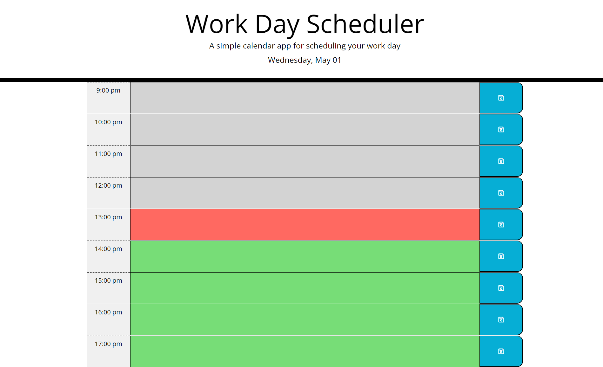

# Daily Planner

## Overview

This is a simple daily planner application. The application allows the user to save events in time blocks of one hour.

# Business Day Planner Features

## 1. Hourly Time Blocks:
   - The planner organizes the day into hourly time blocks, making it easy to plan and manage events throughout the business hours.

## 2. Simple User Interface:
   - The application provides a straightforward and user-friendly interface. You can easily interact with the planner to manage your daily schedule.

## 3. Event Creation and Editing:
   - Users can click on the text area corresponding to each time block to input their events. The entered events are editable at any time, offering flexibility in managing your schedule.

## 4. Intuitive Interaction:
   - The planner's design aims to be intuitive, allowing users to quickly grasp how to add, edit, and save events for effective time management.

## 5. Color-Coded Time Blocks:
   - The text area changes colors dynamically throughout the day, providing a visual representation of the timeline.
     - **Grey:** Past time blocks.
     - **Red:** Current hour.
     - **Green:** Upcoming time blocks.

## 6. Responsive Design:
   - The application is designed to be responsive, ensuring a seamless experience across various devices.

## Tools

- HTML
- CSS 
- BOOTSTRAP
- jQuery

## Preview

You Can see a live demo [here](https://danilorua.github.io/daily-Planner-App)